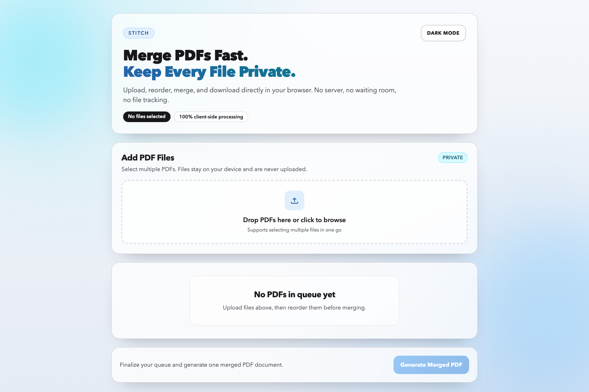

# Stitch

> Merge PDF files entirely in your browser — no server, no uploads, no tracking.

**[Live Demo](#)** &nbsp;·&nbsp; React 18 &nbsp;·&nbsp; TypeScript &nbsp;·&nbsp; Vite &nbsp;·&nbsp; Tailwind CSS



---

## Features

- **Drag-and-drop upload** — drop files onto the zone or click to browse
- **Mixed-file protection** — non-PDF files are discarded automatically with a warning toast
- **Drag-to-reorder** — rearrange the merge queue by dragging; ↑ ↓ buttons available as a keyboard fallback
- **Per-file preview** — open any uploaded PDF in a new tab before merging
- **Inline result preview** — merged PDF renders in an iframe the moment processing completes
- **Download merged output** — saved locally, never sent anywhere
- **Light / dark theme** — follows system preference, persisted in `localStorage`

## Stack

| Concern | Choice |
|---|---|
| Framework | React 18 + TypeScript |
| Build | Vite |
| Styling | Tailwind CSS |
| PDF processing | pdf-lib |
| Drag and drop | Native HTML5 DnD API |
| Linting / formatting | ESLint + Prettier |

## Design decisions

**No drag-and-drop library** — the native HTML5 Drag and Drop API handles list reordering without any dependencies. Libraries like `@dnd-kit` add weight and maintenance overhead for a problem the browser already solves natively.

**No backend** — `pdf-lib` reads and merges files directly in the browser using `ArrayBuffer`. Zero infrastructure, zero latency, complete privacy.

## Getting started

```bash
npm install
npm run dev        # http://localhost:5173
npm run build      # production build
npm run lint       # ESLint
npm run format     # Prettier
```
